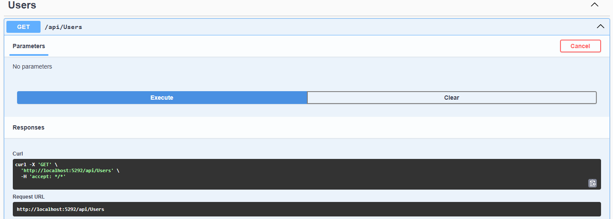
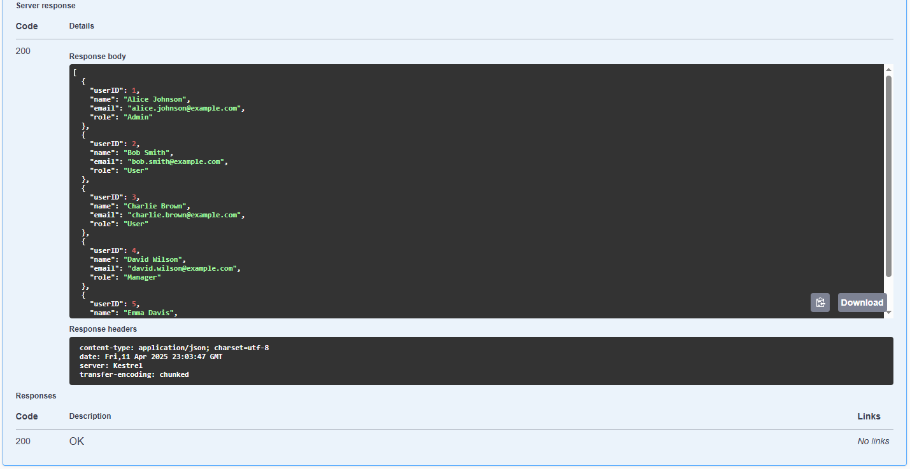
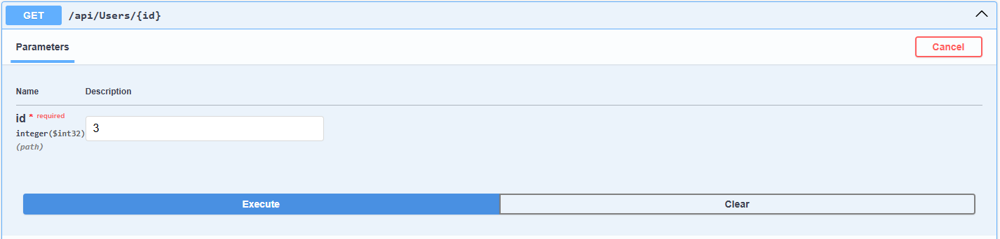
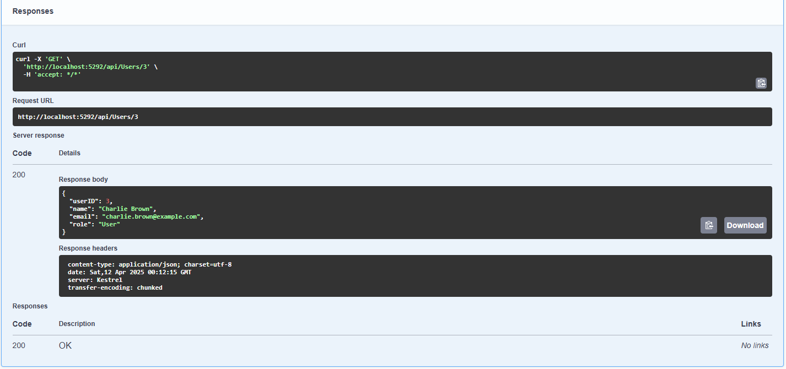
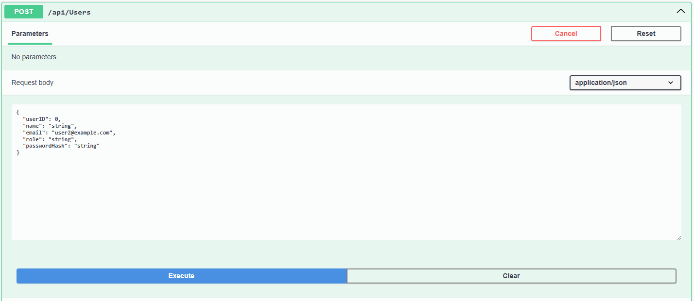
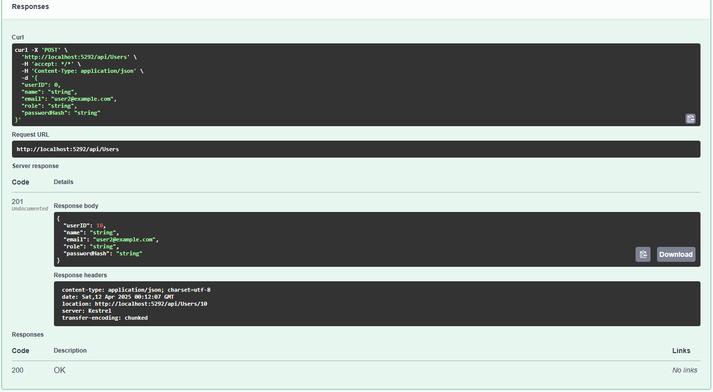
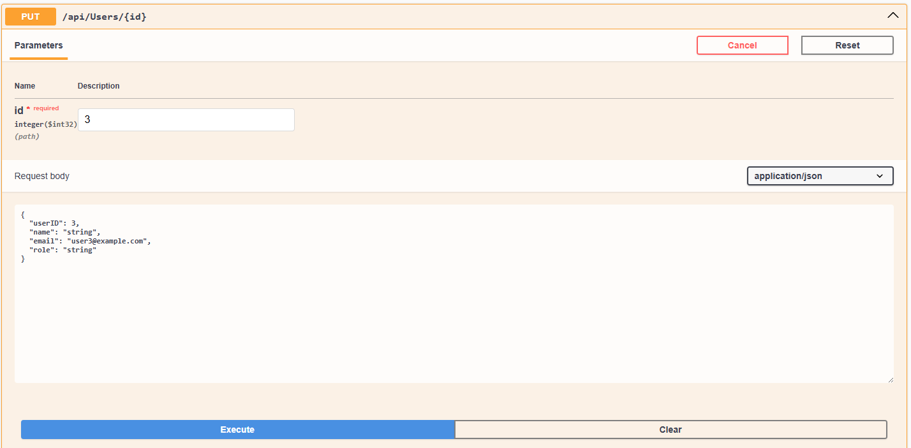
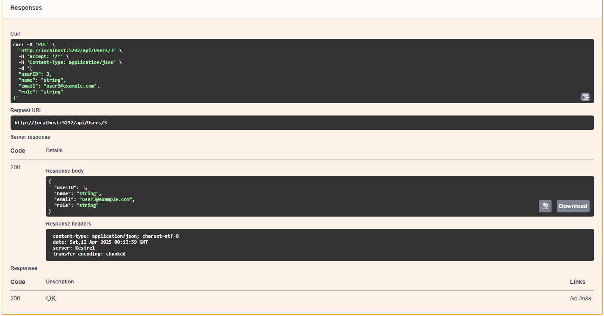
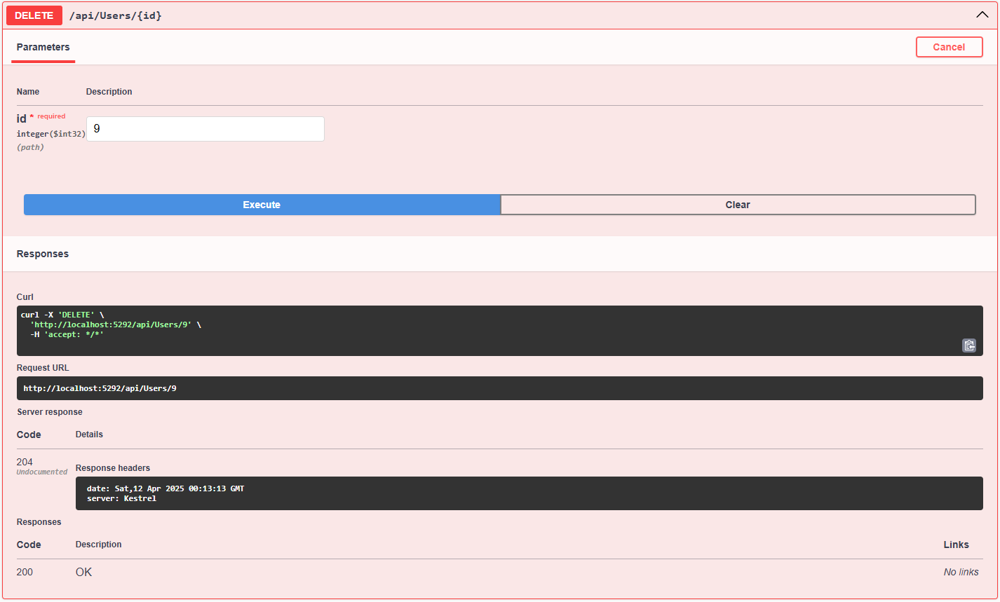

# PackageTrackingAPI

A RESTful API for managing users, packages, tracking events, and alerts in a package tracking system.  
Built with ASP.NET Core, Entity Framework Core, and AutoMapper.

---

## Features

- User management (CRUD)
- Package management (CRUD)
- Tracking events linked to packages
- Alerts linked to users and packages
- Data validation and error handling
- Seed data for initial testing

---

## Technologies Used

- .NET 8.0
- ASP.NET Core Web API
- Entity Framework Core (Code First)
- AutoMapper
- Swagger (OpenAPI) for API documentation

---
## Swagger API documentation

Take the 'Users' interface as an example

- Getall

- Get by ID

- Post

- Put

- Delete
